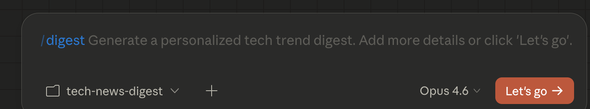
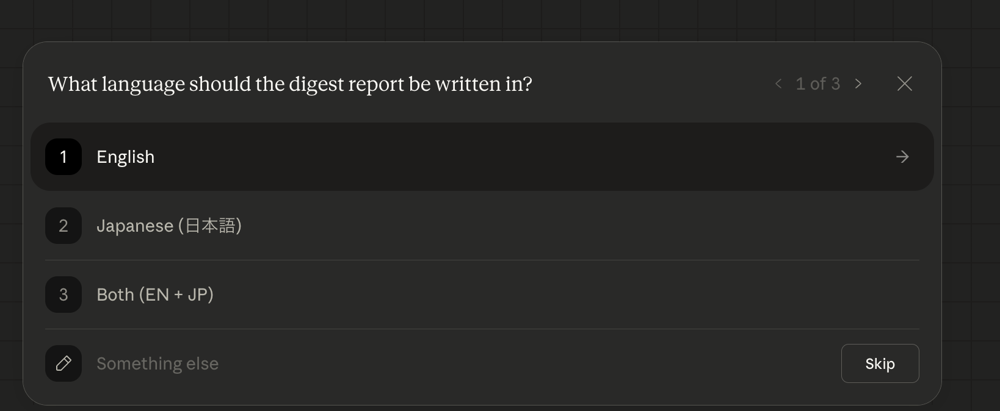
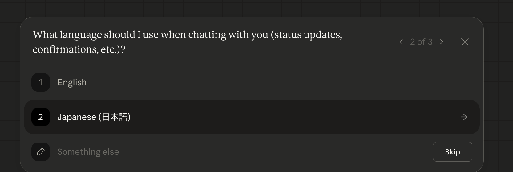
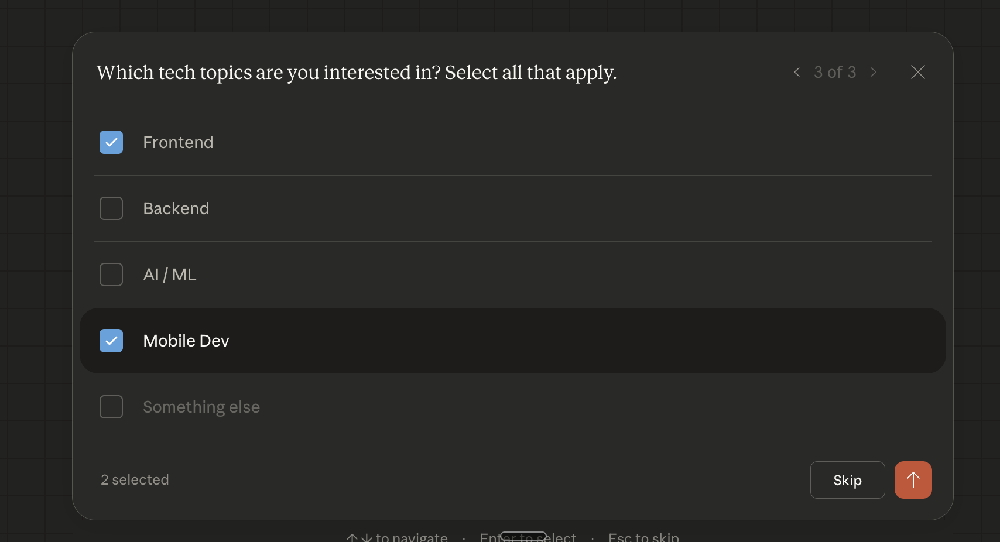
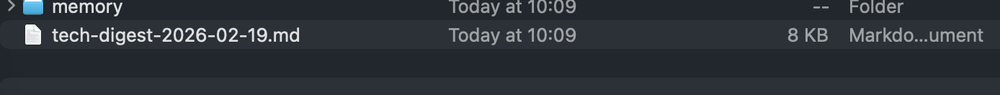

# Tech Trend Digest

A plugin that curates personalized tech news digests from authoritative sources.

## Commands

| Command | Description |
|---------|-------------|
| `/digest` | Generate a new tech trend digest |
| `/digest-preferences` | Update your language, chat language, and topic preferences |

## Screenshots

### Running the `/digest` command

### First-run setup (1/3): Choose digest language

### First-run setup (2/3): Choose chat language

### First-run setup (3/3): Select topics

### Output: Generated digest file

## Setup

On first run, you'll pick:

- **Digest language** — English, Japanese, or Both
- **Chat language** — the language used for conversational responses
- **Topics** — Frontend, Backend, Mobile, AI/ML, DevOps, PM/Culture, Security, or custom

Preferences are saved to `memory/tech-trend-digest-preferences.md` and reused automatically.

## How it works

Each run searches multiple sources, validates freshness (publication date required, within 30 days), deduplicates against past digests, and outputs a markdown report with freshness badges (🟢 ≤14d, 🟡 15-30d, 🟠 30d+).

Past digest URLs are tracked in `memory/tech-trend-digest-history.md`.

---

# Tech Trend Digest (日本語)

技術ニュースを厳選してダイジェストにまとめるプラグインです。

## コマンド

| コマンド | 説明 |
|---------|------|
| `/digest` | 新しいテックダイジェストを生成 |
| `/digest-preferences` | 言語・チャット言語・トピックの設定を変更 |

## スクリーンショット

### `/digest` コマンドの実行

### 初回セットアップ (1/3): ダイジェスト言語の選択

### 初回セットアップ (2/3): チャット言語の選択

### 初回セットアップ (3/3): トピックの選択

### 出力: 生成されたダイジェストファイル

## 初回セットアップ

初回実行時に以下を選択します：

- **ダイジェスト言語** — English / Japanese / Both
- **チャット言語** — 会話応答に使用される言語
- **トピック** — Frontend、Backend、Mobile、AI/ML、DevOps、PM/Culture、Security、またはカスタム

設定は `memory/tech-trend-digest-preferences.md` に保存され、次回以降は自動で使用されます。

## 仕組み

実行のたびに複数のソースを検索し、鮮度を検証（公開日必須・30日以内）、過去のダイジェストと重複排除を行い、鮮度バッジ付き（🟢 ≤14日、🟡 15-30日、🟠 30日超）のMarkdownレポートを出力します。

過去のURL履歴は `memory/tech-trend-digest-history.md` に記録されます。
